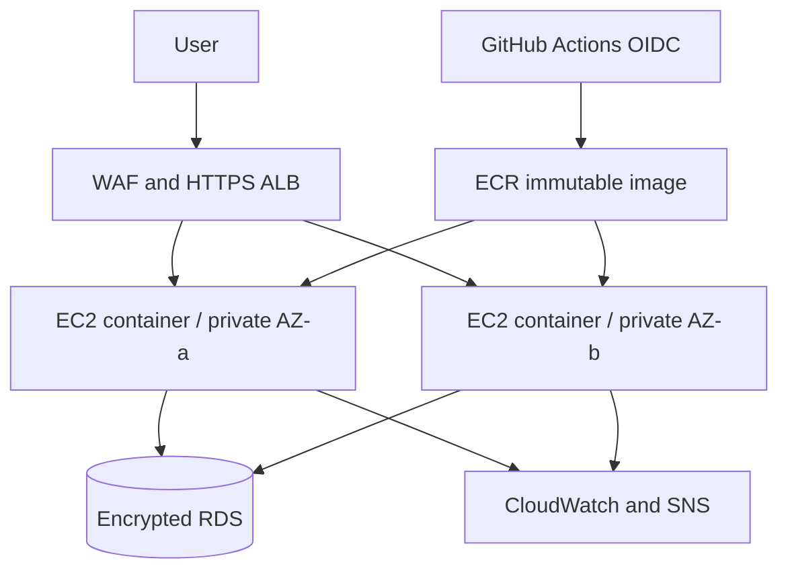

# CloudPulse — Highly Available AWS Web Platform

[](https://github.com/Olivierg98/cloudpulse-aws-platform/actions/workflows/ci.yml)
[](https://github.com/Olivierg98/cloudpulse-aws-platform/actions/workflows/security.yml)

A production-style cloud engineering portfolio project by **Olivier Gouna**. CloudPulse provisions a resilient AWS web platform with Terraform and runs a containerised FastAPI service behind an Application Load Balancer. The repository separates inexpensive development defaults from production controls that incur AWS charges.

## Skills demonstrated

| Area | Evidence in this repository |
|---|---|
| AWS architecture | VPC, two AZs, ALB, EC2 Auto Scaling, ECR, optional RDS and NAT |
| Infrastructure as Code | Reusable Terraform module, dev/prod composition and S3 state bootstrap |
| Linux and containers | Amazon Linux bootstrap, non-root Docker image and health checks |
| Security | No inbound SSH, SSM, IMDSv2, WAF, GuardDuty, Secrets Manager and Trivy |
| Reliability | Load-balancer health checks, desired-capacity recovery, rolling refresh and scaling policy |
| Operations | Dashboard, SNS alarm, smoke test, runbook and documented failure drills |
| CI/CD | GitHub OIDC, immutable ECR images, Terraform validation, deployment and security gate |
| Cost control | AWS Budget, explicit trade-offs, tagged resources and controlled teardown |

## Architecture



See [the detailed architecture](docs/ARCHITECTURE.md), [deployment guide](docs/DEPLOYMENT.md), [incident runbook](docs/INCIDENT-RUNBOOK.md), [threat model](docs/THREAT-MODEL.md), [failure drills](docs/FAILURE-DRILLS.md), and [engineering trade-offs](docs/TRADEOFFS.md).

## Run locally

```bash
git clone https://github.com/Olivierg98/cloudpulse-aws-platform.git
cd cloudpulse-aws-platform
docker compose up --build
curl http://localhost:8000/health
```

Open `http://localhost:8000` to view the runtime dashboard.

## Test and validate

```bash
python -m venv .venv
source .venv/bin/activate
pip install -r requirements.txt
pytest -q
terraform fmt -check -recursive infra
terraform -chdir=infra/environments/dev init -backend=false
terraform -chdir=infra/environments/dev validate
terraform -chdir=infra/environments/prod init -backend=false
terraform -chdir=infra/environments/prod validate
```

## Deploy to AWS

Prerequisites: AWS CLI credentials, Terraform 1.7+, and an AWS account with permission to create the documented resources. Start with development; production enables chargeable NAT, RDS, WAF and security services.

```bash
cd infra/environments/dev
terraform init
terraform plan -out=tfplan
terraform apply tfplan
terraform output application_url
```

Run the [smoke test](scripts/smoke-test.sh) against the output URL. AWS resources incur charges. Destroy them after collecting evidence:

```bash
terraform destroy
```

For repeatable releases, follow the [deployment guide](docs/DEPLOYMENT.md) and run the manual **Deploy AWS** workflow. Production should use a protected GitHub environment with a required reviewer.

## Operational evidence

Architecture in code is not the same as a verified deployment. The [evidence checklist](docs/EVIDENCE-CHECKLIST.md) distinguishes implemented controls from controls tested in Olivier's AWS account. Redacted screenshots and measured results are added only after deployment.

## Walkthrough

ALB provides the controlled ingress path while instances remain inaccessible through inbound SSH.

Auto Scaling provides replacement of unhealthy instances across Availability Zones.

Terraform modules separate reusable infrastructure from environment configuration.

CloudWatch monitoring and failure drills provide operational validation.

Cost, security and resilience trade-offs are documented alongside evidence still required from a live deployment.
