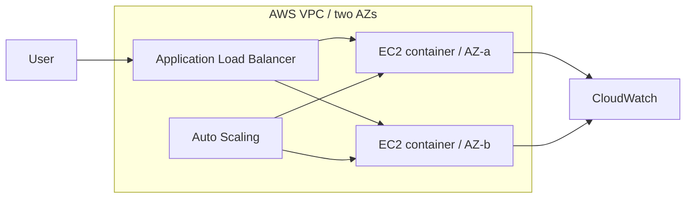

# CloudPulse — Highly Available AWS Web Platform

[](https://github.com/Olivierg98/cloudpulse-aws-platform/actions/workflows/ci.yml)
[](https://github.com/Olivierg98/cloudpulse-aws-platform/actions/workflows/security.yml)

A production-style cloud engineering portfolio project by **Olivier Gouna**. CloudPulse provisions a resilient AWS web platform with Terraform and runs a containerised FastAPI service behind an Application Load Balancer.

## Skills demonstrated

| Area | Evidence in this repository |
|---|---|
| AWS architecture | VPC, two AZs, ALB, EC2 Auto Scaling, IAM and CloudWatch |
| Infrastructure as Code | Reusable Terraform module, validated variables and environment composition |
| Linux and containers | Amazon Linux bootstrap, non-root Docker image and health checks |
| Security | No inbound SSH, SSM role, IMDSv2, scoped security groups and Trivy scanning |
| Reliability | Load-balancer health checks, desired-capacity recovery, rolling refresh and scaling policy |
| Operations | Dashboard, unhealthy-target alarm, smoke test and documented failure drills |
| CI/CD | GitHub Actions tests, image build, Terraform validation and security gate |
| Cost control | Explicit trade-offs, tagged resources and one-command teardown |

## Architecture



See [the detailed architecture](docs/ARCHITECTURE.md), [failure drills](docs/FAILURE-DRILLS.md), and [engineering trade-offs](docs/TRADEOFFS.md).

## Run locally

```bash
git clone https://github.com/Olivierg98/cloudpulse-aws-platform.git
cd cloudpulse-aws-platform
docker compose up --build
curl http://localhost:8000/health
```

Open `http://localhost:8000` to view the runtime dashboard.

## Test and validate

```bash
python -m venv .venv
source .venv/bin/activate
pip install -r requirements.txt
pytest -q
terraform fmt -check -recursive infra
terraform -chdir=infra/environments/dev init -backend=false
terraform -chdir=infra/environments/dev validate
```

## Deploy to AWS

Prerequisites: AWS CLI credentials, Terraform 1.7+, and an AWS account with permission to create the documented resources.

```bash
cd infra/environments/dev
terraform init
terraform plan -out=tfplan
terraform apply tfplan
terraform output application_url
```

Run the [smoke test](scripts/smoke-test.sh) against the output URL. AWS resources incur charges. Destroy them after collecting evidence:

```bash
terraform destroy
```

Walkthrough
ALB provides the controlled ingress path while instances remain inaccessible through inbound SSH.
Auto Scaling provides replacement of unhealthy instances across Availability Zones.
Terraform modules separate reusable infrastructure from environment configuration.
CloudWatch monitoring and failure drills provide operational validation.
Cost, security and resilience trade-offs are documented alongside potential production extensions.
