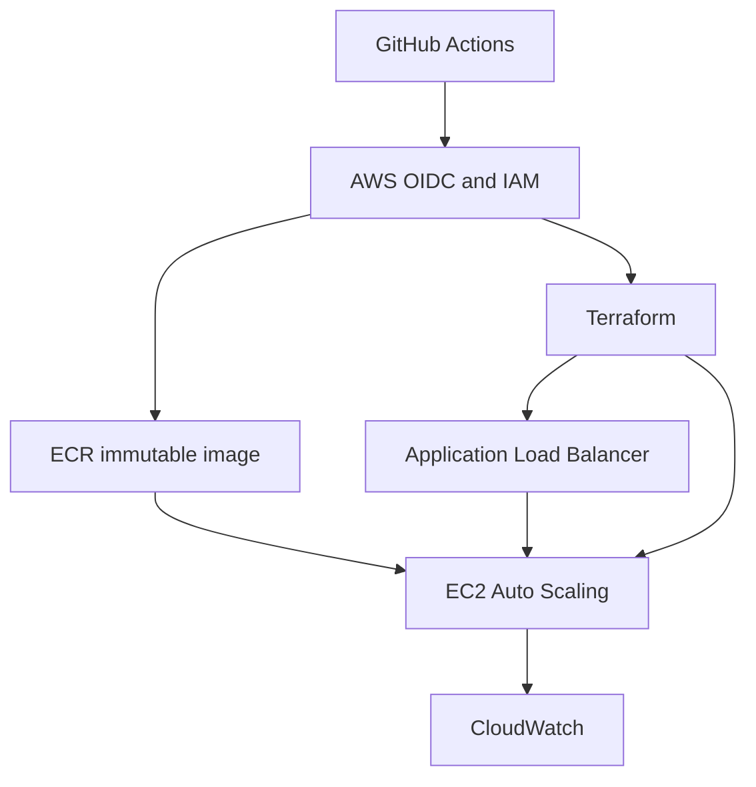
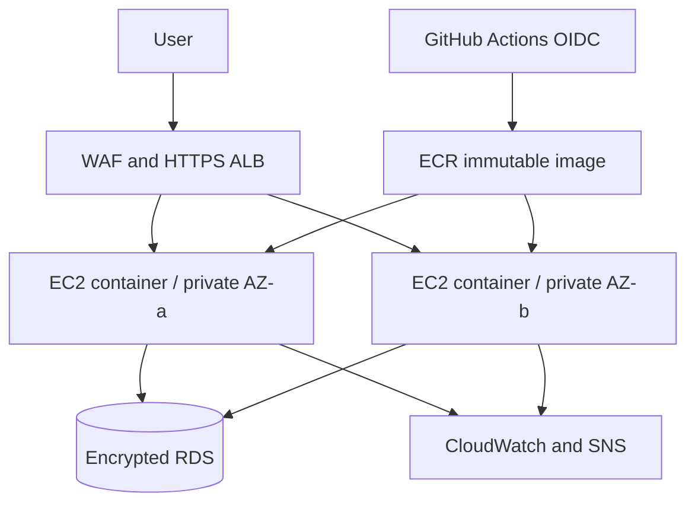

# CloudPulse — Highly Available AWS Web Platform

[](https://github.com/Olivierg98/cloudpulse-aws-platform/actions/workflows/ci.yml)
[](https://github.com/Olivierg98/cloudpulse-aws-platform/actions/workflows/security.yml)
[](https://github.com/Olivierg98/cloudpulse-aws-platform/actions/workflows/deploy.yml)

A production-style cloud engineering portfolio project by **Olivier Gouna**. CloudPulse provisions a resilient AWS web platform with Terraform and runs a containerised FastAPI service behind an Application Load Balancer. The repository separates inexpensive development defaults from production controls that incur AWS charges.

## Skills demonstrated

| Area | Evidence in this repository |
|---|---|
| AWS architecture | VPC, two AZs, ALB, EC2 Auto Scaling, ECR, optional RDS and NAT |
| Infrastructure as Code | Reusable Terraform module, dev/prod composition and S3 state bootstrap |
| Linux and containers | Amazon Linux bootstrap, non-root Docker image and health checks |
| Security | No inbound SSH, SSM, IMDSv2, WAF, GuardDuty, Secrets Manager and Trivy |
| Reliability | Load-balancer health checks, desired-capacity recovery, rolling refresh and scaling policy |
| Operations | Dashboard, SNS alarm, smoke test, runbook and documented failure drills |
| CI/CD | GitHub OIDC, immutable ECR images, Terraform validation, deployment and security gate |
| Cost control | AWS Budget, explicit trade-offs, tagged resources and controlled teardown |

## Deployed development architecture

The development environment has been deployed and verified in `eu-west-2`. It uses the same reusable platform module as production, with expensive production-only controls disabled.



### Deployment flow

1. A manual GitHub Actions workflow starts the release.
2. GitHub authenticates to AWS through OIDC and assumes a short-lived IAM role; no permanent AWS access keys are stored in GitHub.
3. Terraform initialises against remote S3 state and ensures the ECR repository exists.
4. GitHub builds the non-root FastAPI Docker image and pushes it to ECR using the unique immutable tag `<commit-sha>-<run-id>`.
5. The workflow resolves the image digest and passes that exact image reference to Terraform.
6. Terraform creates or updates the VPC, subnets, load balancer, launch template, Auto Scaling group, IAM and monitoring resources.
7. EC2 pulls and starts the container. The Application Load Balancer exposes the service and performs health checks.
8. Automated smoke tests call the live health, instance and database-status endpoints before the deployment is marked successful.

## Target production architecture

The production configuration extends the verified development platform with HTTPS, WAF, NAT, encrypted RDS, Secrets Manager, GuardDuty and additional operational controls. These resources are optional because they incur additional AWS charges.



See [the detailed architecture](docs/ARCHITECTURE.md), [deployment guide](docs/DEPLOYMENT.md), [incident runbook](docs/INCIDENT-RUNBOOK.md), [threat model](docs/THREAT-MODEL.md), [failure drills](docs/FAILURE-DRILLS.md), and [engineering trade-offs](docs/TRADEOFFS.md).

## Run locally

```bash
git clone https://github.com/Olivierg98/cloudpulse-aws-platform.git
cd cloudpulse-aws-platform
docker compose up --build
curl http://localhost:8000/health
```

Open `http://localhost:8000` to view the runtime dashboard.

## Test and validate

```bash
python -m venv .venv
source .venv/bin/activate
pip install -r requirements.txt
pytest -q
terraform fmt -check -recursive infra
terraform -chdir=infra/environments/dev init -backend=false
terraform -chdir=infra/environments/dev validate
terraform -chdir=infra/environments/prod init -backend=false
terraform -chdir=infra/environments/prod validate
```

## Deploy to AWS

The recommended release path is the manual **Deploy AWS** GitHub Actions workflow. It uses OIDC for temporary AWS credentials and deploys a uniquely tagged, digest-pinned container image.

For local administration, prerequisites are AWS CLI credentials, Terraform 1.7+, and an AWS account with permission to create the documented resources. Start with development; production enables chargeable NAT, RDS, WAF and security services.

```bash
cd infra/environments/dev
terraform init
terraform plan -out=tfplan
terraform apply tfplan
terraform output application_url
```

Run the [smoke test](scripts/smoke-test.sh) against the output URL. AWS resources incur charges. Destroy them after collecting evidence:

```bash
terraform destroy
```

For repeatable releases, follow the [deployment guide](docs/DEPLOYMENT.md). Production should use a protected GitHub environment with a required reviewer.

## Verified deployment evidence

[GitHub Actions run #7](https://github.com/Olivierg98/cloudpulse-aws-platform/actions/runs/35581600501) successfully deployed commit `3fc49e5` to the development environment in `eu-west-2`.

The run verified:

- GitHub-to-AWS authentication through OIDC.
- Terraform initialisation using remote state.
- An immutable Docker image built and pushed to ECR.
- Deployment by exact SHA-256 image digest.
- An in-place EC2 launch-template update through Terraform.
- A healthy response from `/health`.
- Runtime information from `/api/instance`.
- Expected `configured: false` status from `/api/database`, because RDS is disabled in the lower-cost development environment.

The [evidence checklist](docs/EVIDENCE-CHECKLIST.md) distinguishes implemented production controls from features tested in the development AWS account.

## Troubleshooting and lessons learned

### IAM permissions

OIDC authentication succeeded before Terraform had permission to perform every required IAM operation. Deployment failures exposed missing read and instance-profile tagging permissions. The GitHub Actions role was updated with narrowly scoped permissions, reinforcing the distinction between authentication (who the workflow is) and authorisation (what it may do).

### Immutable ECR tags

Initial retries reused the Git commit SHA as the Docker tag. Because ECR tag immutability was enabled, ECR correctly rejected attempts to overwrite that tag. The workflow now combines the commit SHA and GitHub run ID, producing a unique and traceable tag for every build, then deploys the resolved image digest.

### Infrastructure readiness

An early smoke test reached the load balancer before EC2 had finished installing Docker, pulling the image and passing target health checks, which produced a temporary `502`. The smoke test was changed to tolerate transient startup failures and retry for up to approximately five minutes. The subsequent deployment passed all live endpoint checks.

## Walkthrough

ALB provides the controlled ingress path while instances remain inaccessible through inbound SSH.

Auto Scaling provides replacement of unhealthy instances across Availability Zones.

Terraform modules separate reusable infrastructure from environment configuration.

CloudWatch monitoring and failure drills provide operational validation.

Cost, security and resilience trade-offs are documented alongside clear evidence of what has been verified in development and what is reserved for production.
