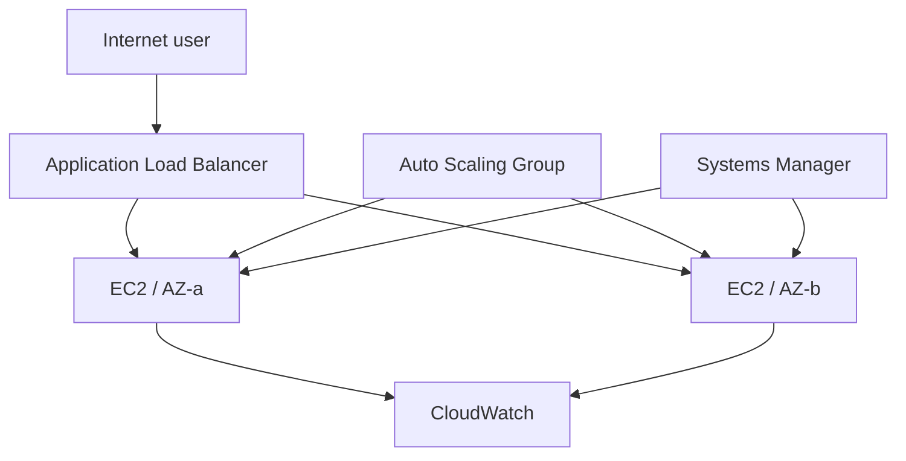

# Architecture

The ALB is the only public entry point. Application security groups accept port 8000 only from the ALB. Instances require IMDSv2 and use Systems Manager instead of inbound SSH. An Auto Scaling Group replaces unhealthy capacity and distributes it across two availability zones.
