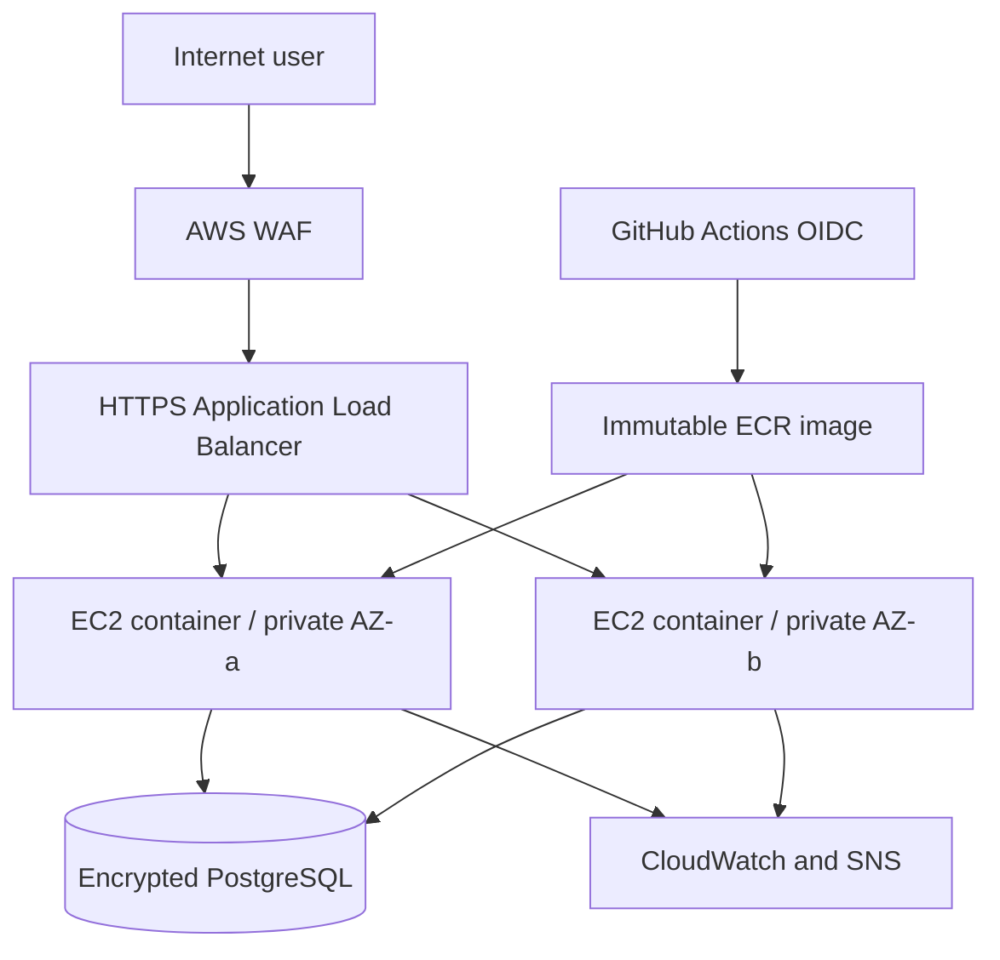

# Architecture

The ALB is the only public entry point. The production profile places compute and RDS in private subnets and uses one NAT gateway for bootstrap egress; a larger production system would use one NAT per Availability Zone or VPC endpoints to remove the single egress dependency. Application security groups accept port 8000 only from the ALB. Instances require IMDSv2 and use Systems Manager instead of inbound SSH. An Auto Scaling Group replaces unhealthy capacity across two Availability Zones.

GitHub Actions exchanges its OIDC identity for short-lived AWS credentials, pushes an immutable image to ECR and deploys the resolved digest. WAF filters common web attacks. Secrets Manager holds generated database credentials, while CloudWatch, SNS and GuardDuty provide operational and security signals.
